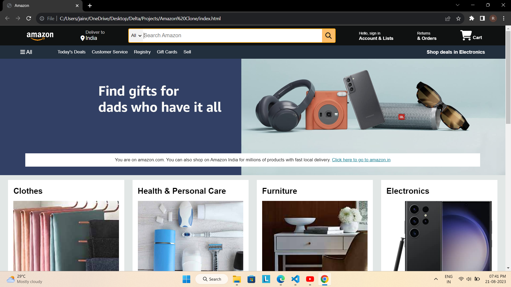

# Amazon Clone

This is an Amazon Clone project that replicates certain features and UI elements of the Amazon website. The project was created using HTML, CSS, and FontAwesome icons. It allows users to explore different product categories, search for products, and navigate through various sections of the website.

## Features

- Navbar: Mimics the Amazon navbar with options for "Deliver to," search, account information, orders, and shopping cart.
- Hero Section: Displays a hero message with a link to Amazon India.
- Shop Section: Displays different product categories with images and links to explore more.
- Footer: Simulates the Amazon footer with links to various sections of the website.

## Getting Started

1. Clone the repository: `git clone [repository_url]`
2. Open the `index.html` file in your browser.

## App Preview

## Technologies Used

- HTML
- CSS
- FontAwesome (for icons)

## Author

[Your Name]

## License

This project is licensed under the MIT License - see the [LICENSE](LICENSE) file for details.
